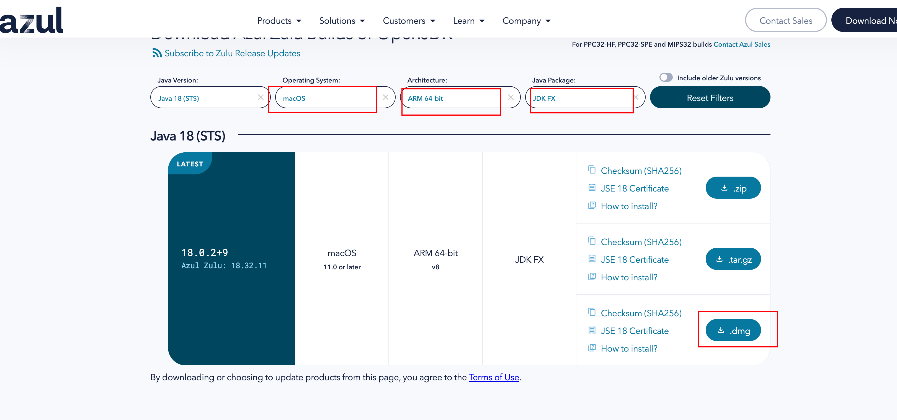
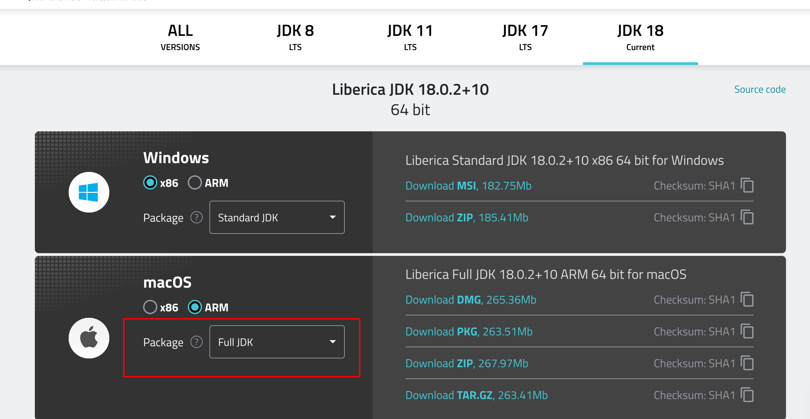
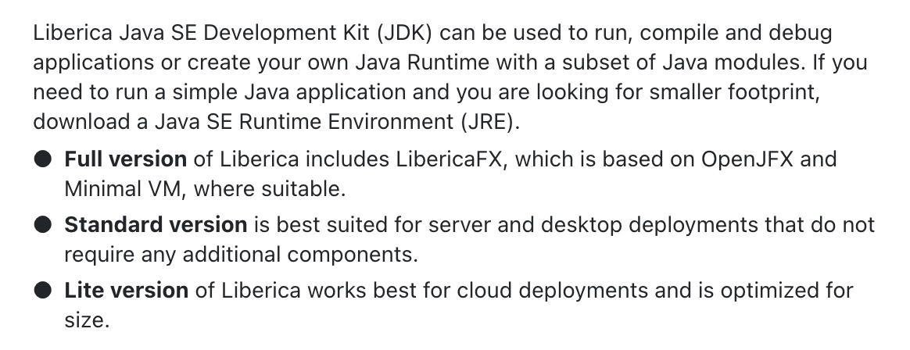
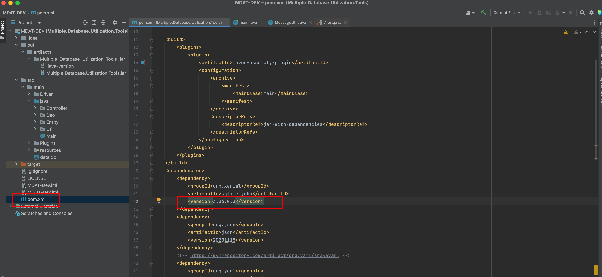
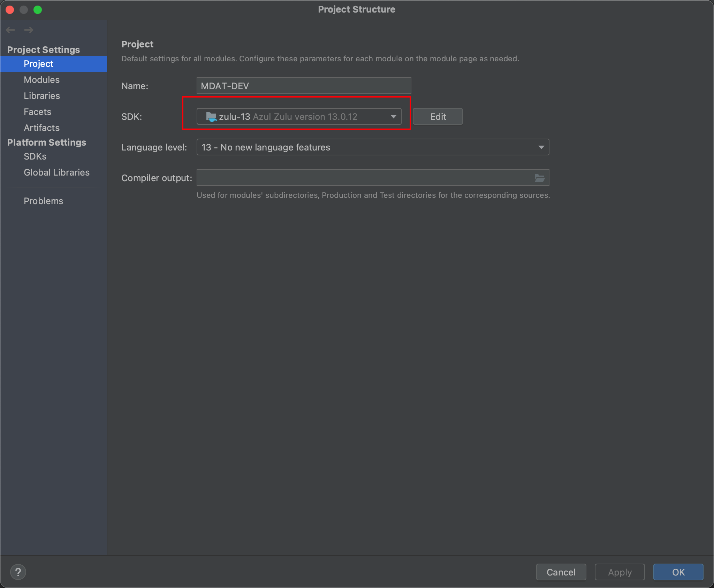
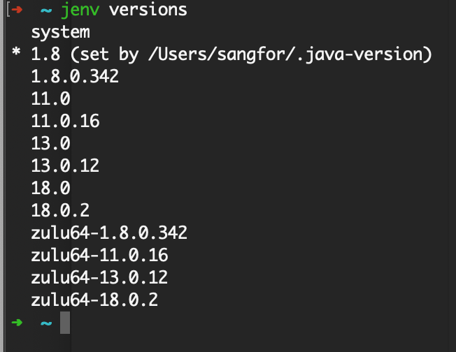

# JDK环境搭建

[toc]

## 选择JDK

__*选择azul或者Liberica的openjdk，*__优点如下：

1. 不用忍受oracle的sb登陆就能直接下载。
2. 很多第三方的OpenJDK都会自带OpenJFX，不存在高版本JDK带JFX的工具无法运行的问题。
3. Arm64全版本支持。
4. 安装方便。


### azul JDK

下载地址：https://www.azul.com/downloads





azul的JDK从8到18都是支持JDK FX的。这里是可以直接下载的，不需要登陆，比oracle的爽太多。下载完了之后直接安装。

### Liberica JDK

下载地址：https://bell-sw.com/pages/downloads/#/





如果使用Liberica的JDK的话8、11、15、17、18都是带JFX的，直接下载dmg就可以安装。

## sqlite JDBC连接错误

平时用的很多工具比如冰蝎、MDUT等等都会连接本地sqlite数据库，如果项目中引入的sqlite-jdbc.jar的版本小于3.34.0的话就会报错，那是因为3.34.0以下的版本是不支持M1芯片的（在mac中现在已经可以正常运行，但是在PD自带的win11虚拟机中还是不行），所以需要把项目源码导入idea更改其中的pom.xml文件中的sqlite-jdbc版本。

下面使用MDUT举例：



打开pom.xml修改其中的sqlite-jdbc版本为3.36.0.3


在File选项中选择Project Structure



我这里选择的是azul的JDK13，你们随便选择其他的也可。


在preferences里记得要把Java Compiler选择到对应的版本直接build就可以了。


可以看到在虚拟机windows11中已经可以正常运行了。


## 使用jenv快速切换jdk版本

本质上跟自己修改环境变量没啥区别，但是这东西还是挺方便的

官网：https://www.jenv.be/

直接使用homebrew安装

```
brew install jenv
```

把jenv添加到环境变量

```
$ echo 'export PATH="$HOME/.jenv/bin:$PATH"' >> ~/.zshrc
$ echo 'eval "$(jenv init -)"' >> ~/.zshrc
```

添加jdk环境进去

```
$ jenv add /System/Library/Java/JavaVirtualMachines/1.6.0.jdk/Contents/Home
  oracle64-1.6.0.39 added
$ jenv add /Library/Java/JavaVirtualMachines/jdk17011.jdk/Contents/Home
  oracle64-1.7.0.11 added
```



拿我的环境举个例子


```
jenv local +版本
```

切换当前shell JDK版本

如果要切换全局shell就使用 `jenv global +版本`

